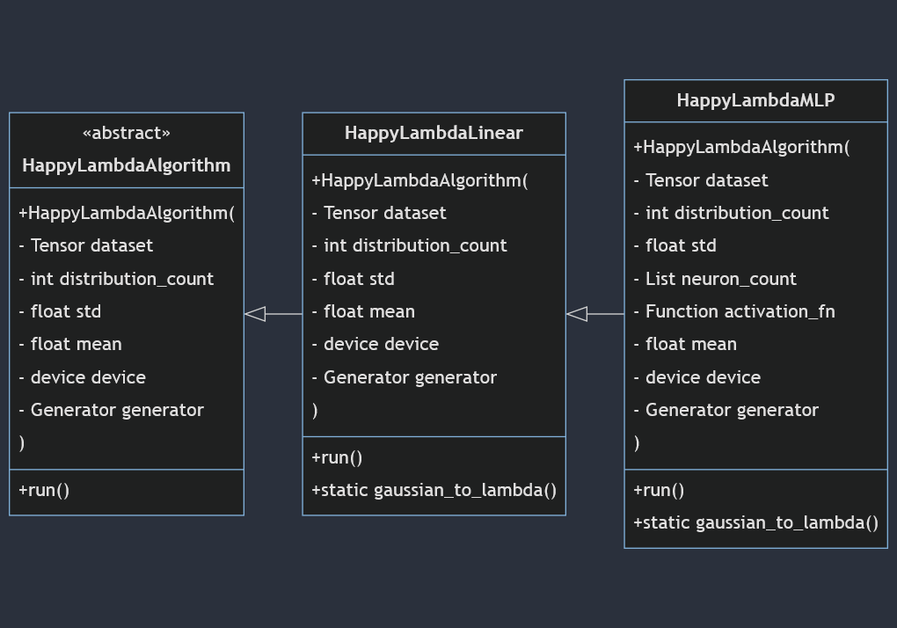

``HappyLambda`` specification
=============================

Because the happy lambda algorithms of the project are not a standard PyTorch componenents such as optimizers or loss functions, they do not inherit PyTorch classes.
Instead, a custom specification was built to specify the general shape a HappyLambda algorithm.

